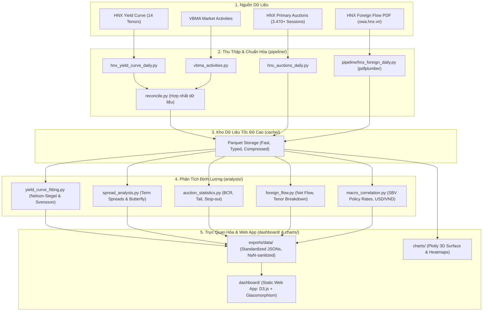

# 📊 VN Bond Yield Pipeline

[](https://www.python.org/)
[](https://opensource.org/licenses/MIT)
[](https://hnx.vn)
[](https://hnx.vn)
[](https://d3js.org/)
[](https://github.com/FTU-kudo/VN_Bond_Yield_pipeline/actions)

> **Hệ sinh thái thu thập dữ liệu tự động, phân tích định lượng (Quantitative Analysis) & trực quan hóa toàn diện thị trường Trái Phiếu Chính Phủ Việt Nam (TPCP / Vietnam Government Bonds).**

---

## 🌟 Điểm Nổi Bật & Tính Năng Đột Phá

- **📡 Thu thập dữ liệu đa nguồn tự động & bền bỉ**:
  - **Lợi suất chuẩn thứ cấp HNX**: Thu thập 14 kỳ hạn chuẩn (từ 1M đến 30Y) từ năm 2006 đến nay.
  - **Đấu thầu sơ cấp HNX**: Lưu trữ và chuẩn hóa **3.470+ phiên đấu thầu** từ tháng 08/2012.
  - **Bóc tách PDF dòng vốn ngoại**: Tự động tải báo cáo từ FTP server HNX (`owa.hnx.vn`) và dùng `pdfplumber` bóc tách **3.394+ ngày giao dịch NĐTNN** từ năm 2013.
  - **Đối chiếu VBMA**: Tự động lấy dữ liệu hoạt động thị trường từ Hiệp hội Thị trường Trái phiếu Việt Nam.
- **📐 Mô hình toán học & Định lượng chuẩn quốc tế**:
  - **Nelson-Siegel 4 tham số & Svensson 6 tham số**: Tối ưu hóa phi tuyến (`scipy.optimize`) tái tạo đường cong lợi suất liên tục từ các kỳ hạn rời rạc.
  - **Phân tích Term Spread đa dạng**: Presets tài chính chuẩn (`10Y-2Y`, `10Y-3M`, `5Y-2Y`, `10Y-1Y`, `30Y-10Y`) và chỉ số bướu `Butterfly 2s5s10s`.
  - **So sánh cặp kỳ hạn tùy biến (Custom Tenor Pair)**: Chọn bất kỳ cặp kỳ hạn nào từ 1M đến 30Y, hệ thống tự động tính chênh lệch real-time từ fitted curve.
  - **Thống kê đấu thầu chuyên sâu**: Tỷ lệ trúng thầu (Success Rate), Tỷ lệ đặt/trúng (Bid-to-Cover Ratio - BCR), Lãi suất trần (Stop-out Rate) và Auction Tail.
- **🖥️ Web Dashboard tĩnh phong cách Glassmorphism đỉnh cao**:
  - **Single Slider with Gliding Date Bubble**: 1 thanh trượt thời gian duy nhất với bong bóng ngày trượt bám sát 100% núm tròn và tooltip xem trước ngày khi hover chuột.
  - **Thước ngắm bám chân trục X (X-axis Date Badge)** trên biểu đồ D3.js khi rê chuột.
  - **Bộ lọc mốc thời gian đồng bộ (Synchronized Date Range Filter)**: `30 Ngày`, `60 Ngày`, `90 Ngày`, `6 Tháng`, `1 Năm`, `Tất cả` hoặc tùy chọn ngày linh hoạt.
  - **Bảng dữ liệu đấu thầu Sticky Header**: Cuộn mượt mà hơn 3.470 dòng mà không vỡ bố cục.
  - **Cẩm nang định lượng tích hợp (`glossary.html`)**: Trình bày công thức toán học qua MathJax, bảng tra cứu nhanh và tìm kiếm tức thì.
  - **Không cần backend phức tạp**: 100% HTML5, Vanilla CSS, D3.js — tương thích hoàn hảo để triển khai trên GitHub Pages.
- **🤖 Tự động hóa CI/CD không cần server**:
  - Tự động chạy daily scan qua GitHub Actions vào cuối mỗi ngày làm việc, phân tích và commit dữ liệu mới trực tiếp lên repository.

---

## 🏛️ Kiến Trúc Hệ Thống & Luồng Dữ Liệu

Hệ thống được thiết kế theo mô hình 5 lớp module hóa cao:



---

## 📁 Cấu Trúc Thư Mục Dự Án

```text
VN_Bond_Yield_pipeline/
├── 📁 pipeline/                      # Module thu thập & tiền xử lý dữ liệu
│   ├── common.py                     # Tiện ích: parse HTML, parse số định dạng VN, cache dates
│   └── hnx_foreign_daily.py          # Cào & bóc tách PDF giao dịch NĐTNN qua pdfplumber
├── 📁 analysis/                      # Động cơ phân tích định lượng (Quantitative Engine)
│   ├── yield_curve_fitting.py        # Fitting Nelson-Siegel 4 tham số & Svensson 6 tham số
│   ├── spread_analysis.py            # Term spread (10Y-2Y, 10Y-3M,...), Butterfly 2s5s10s, Inversion
│   ├── auction_statistics.py         # Thống kê đấu thầu: BCR, stop-out rate, tail, success rate
│   ├── foreign_flow.py               # Phân tích dòng vốn khối ngoại mua/bán ròng
│   └── macro_correlation.py          # Tương quan lãi suất điều hành SBV và tỷ giá USD/VND
├── 📁 dashboard/                     # Web Dashboard tĩnh (Glassmorphism & D3.js)
│   ├── index.html                    # Trang tổng quan thị trường TPCP & Interactive Spread Manager
│   ├── yield_curve.html              # Phân tích chi tiết đường cong lợi suất & so sánh lịch sử
│   ├── auctions.html                 # Phân tích chi tiết kết quả đấu thầu sơ cấp
│   ├── foreign_flows.html            # Phân tích chi tiết dòng vốn NĐTNN
│   ├── glossary.html                 # Cẩm nang giải thích thuật ngữ & công thức toán học MathJax
│   └── assets/
│       ├── style.css                 # Design System Dark/Light Glassmorphism, Modern Typography
│       └── app.js                    # Core D3.js chart renderers, slider controllers, dynamic filters
├── 📁 charts/                        # Script tạo biểu đồ chuyên sâu Plotly
│   ├── yield_curve_3d.py             # 3D Yield Surface theo thời gian
│   ├── heatmap_yield.py              # Heatmap lợi suất (Tenor × Date)
│   └── auction_dashboard.py          # Dashboard 4-panel phân tích đấu thầu
├── 📁 cache/                         # Kho dữ liệu Parquet nén tốc độ cao (được commit vào repo)
├── 📁 exports/data/                  # Dữ liệu JSON chuẩn hóa phục vụ Web Dashboard
├── .github/workflows/                # CI/CD Workflows tự động
│   ├── daily_update.yml              # Tự động chạy daily update & push dữ liệu mỗi chiều
│   └── backfill.yml                  # Workflow dispatch chạy backfill lịch sử thủ công
├── hnx_auctions_daily.py             # Script cào kết quả đấu thầu sơ cấp HNX
├── hnx_yield_curve_daily.py          # Script cào đường cong lợi suất chuẩn thứ cấp HNX
├── vbma_activities.py                # Script cào dữ liệu đối chiếu từ VBMA
├── reconcile.py                      # Hợp nhất nguồn HNX và VBMA thành bảng chuẩn
├── run_pipeline.py                   # Entrypoint điều khiển toàn bộ pipeline
├── requirements.txt                  # Danh sách thư viện phụ thuộc
├── index.html                        # Trang chuyển hướng root tới dashboard/index.html (GitHub Pages)
├── .env.example                      # Template cấu hình biến môi trường
└── README.md                         # Tài liệu hướng dẫn dự án
```

---

## 📊 Quy Mô Dữ Liệu Trong Hệ Thống

| Nhóm Dữ Liệu | Nguồn Thu Thập | File Cache Parquet | File Export JSON | Quy Mô Bản Ghi | Phạm Vi Thời Gian |
| :--- | :--- | :--- | :--- | :--- | :--- |
| **Lợi suất chuẩn HNX** | HNX TPCP Thứ Cấp | `combined_tpcp_yields.parquet` | `fitted_curve_ns.json` | 14 kỳ hạn / ngày | 2006 – Hiện tại |
| **Đấu thầu sơ cấp** | HNX Đấu Thầu TPCP | `auction_all_auctions.parquet` | `auction_stats.json` | **3.470+ phiên** | 08/2012 – Hiện tại |
| **Giao dịch khối ngoại** | PDF FTP `owa.hnx.vn` | `foreign_daily_flow.parquet` | `foreign_flow.json` | **3.394+ ngày GD** | 01/2013 – Hiện tại |
| **Lịch sử Term Spread** | Nelson-Siegel Model | `spread_analysis.parquet` | `spread_analysis.json` | 4.500+ ngày | 2006 – Hiện tại |
| **Nelson-Siegel Params**| Scipy Optimization | `fitted_params_ns.parquet` | *(Nội bộ pipeline)* | $\beta_0, \beta_1, \beta_2, \lambda$ | 2006 – Hiện tại |

---

## ⚙️ Cài Đặt & Khởi Chạy Nhanh

### 1. Yêu cầu môi trường
- Python 3.10 trở lên.
- Git.

### 2. Cài đặt các thư viện phụ thuộc

```bash
# Clone repository
git clone https://github.com/FTU-kudo/VN_Bond_Yield_pipeline.git
cd VN_Bond_Yield_pipeline

# Khởi tạo và kích hoạt môi trường ảo (khuyến nghị)
python -m venv .venv
# Trên Windows:
.venv\Scripts\activate
# Trên Linux/macOS:
source .venv/bin/activate

# Cài đặt thư viện
pip install -r requirements.txt
```

---

## 🚀 Hướng Dẫn Vận Hành Pipeline (`run_pipeline.py`)

File `run_pipeline.py` là trung tâm điều khiển (Entrypoint) cho toàn bộ quy trình từ cào dữ liệu, làm sạch, phân tích định lượng đến xuất bản web:

```bash
# 1. Cập nhật hàng ngày (Chế độ khuyến nghị dùng hàng ngày sau 17:00 ICT)
# Chỉ quét 7 ngày gần nhất, tự động bỏ qua ngày đã có, thời gian chạy ~15-30 giây
python run_pipeline.py --mode daily

# 2. Backfill toàn bộ lịch sử (Chạy lần đầu hoặc muốn làm mới toàn bộ từ 2012)
python run_pipeline.py --mode full --start 2012-01-01

# 3. Backfill nhanh từ năm 2020 (Đủ bao quát chu kỳ lãi suất gần nhất)
python run_pipeline.py --mode full --start 2020-01-01

# 4. Chỉ chạy phân tích định lượng (Tính lại NS fitting, spread từ cache đã có)
python run_pipeline.py --mode analyze

# 5. Chỉ xuất file JSON cho Web Dashboard từ cache
python run_pipeline.py --mode export

# 6. Chỉ tạo biểu đồ chuyên sâu Plotly HTML (3D Surface, Heatmap)
python run_pipeline.py --mode charts
```

### Các tùy chọn tham số hữu ích:
- `--mode`: `full` | `daily` | `collect` | `analyze` | `export` | `charts` (mặc định: `daily`).
- `--start`: Ngày bắt đầu định dạng `YYYY-MM-DD` (mặc định: `2012-01-01`).
- `--end`: Ngày kết thúc (mặc định: hôm nay).
- `--cache-dir`: Đường dẫn thư mục cache Parquet (mặc định: `./cache`).
- `--exports-dir`: Đường dẫn thư mục xuất bản (mặc định: `./exports`).
- `--strict`: Dừng pipeline ngay lập tức nếu bất kỳ bước nào gặp lỗi.
- `--quiet`: Chạy chế độ yên lặng, giảm thiểu log console.

---

## 🖥️ Trực Quan Hóa & Web Dashboard

Dự án đi kèm một ứng dụng web tĩnh được xây dựng bằng **Vanilla HTML5, CSS3 Glassmorphism và D3.js**. Không đòi hỏi máy chủ NodeJS hay database, có thể chạy trực tiếp từ file hoặc host qua GitHub Pages.

### Cách xem cục bộ:
Chạy một HTTP server đơn giản từ thư mục gốc:
```bash
python -m http.server 8089
```
Mở trình duyệt truy cập:
- **Trang chủ Tổng quan:** [http://localhost:8089/dashboard/](http://localhost:8089/dashboard/)
- **Đường cong lợi suất & So sánh:** [http://localhost:8089/dashboard/yield_curve.html](http://localhost:8089/dashboard/yield_curve.html)
- **Thống kê đấu thầu sơ cấp:** [http://localhost:8089/dashboard/auctions.html](http://localhost:8089/dashboard/auctions.html)
- **Dòng vốn khối ngoại:** [http://localhost:8089/dashboard/foreign_flows.html](http://localhost:8089/dashboard/foreign_flows.html)
- **Cẩm nang thuật ngữ & Công thức:** [http://localhost:8089/dashboard/glossary.html](http://localhost:8089/dashboard/glossary.html)

### Các tính năng UI/UX nổi bật trên Dashboard:
1. **Interactive Term Spread Manager**:
   - Thanh trượt mốc thời gian đơn tinh gọn với **Bong bóng ngày nổi (`.slider-thumb-bubble`)** gắn trực tiếp phía trên núm tròn, trượt đồng bộ 100% khi người dùng kéo.
   - Thẻ **Xem trước ngày (`.slider-hover-preview`)** khi di chuột trên track của slider.
   - Bộ chọn cặp kỳ hạn tùy ý từ 1M đến 30Y tính toán real-time từ dữ liệu Nelson-Siegel fitted curve.
   - Thước ngắm nét đứt và nhãn ngày bám sát chân trục X (`hover-axis-badge`) khi rê chuột trên đồ thị D3.
2. **Bộ lọc thời gian đồng bộ (Synchronized Date Range Filter)**:
   - Các nút chọn nhanh: `30 Ngày`, `60 Ngày`, `90 Ngày`, `6 Tháng`, `1 Năm`, `Tất cả` kèm bộ chọn lịch linh hoạt.
   - Tác động đồng thời lên cả khối thống kê đấu thầu (3.470 phiên) và biểu đồ dòng vốn ngoại (3.394 ngày).
3. **Bảng dữ liệu đấu thầu Sticky Header**:
   - Header bảng cố định khi cuộn danh sách hàng ngàn phiên đấu thầu, giúp trải nghiệm duyệt số liệu rõ ràng và thuận tiện.
4. **Cẩm nang giải thích thuật ngữ MathJax (`glossary.html`)**:
   - Hệ thống hóa toàn bộ công thức toán học tài chính, ý nghĩa kinh tế, tín hiệu cảnh báo và ứng dụng thực tiễn của từng chỉ số.

---

## 📈 Cơ Sở Định Lượng & Mô Hình Toán Học

### 1. Mô hình nội suy Nelson-Siegel (1987)
Mô hình chuẩn quốc tế được áp dụng bởi Ngân hàng Thanh toán Quốc tế (BIS) và Cục Dự trữ Liên bang Mỹ (FED) để biểu diễn đường cong lợi suất liên tục $y(m)$ theo kỳ hạn $m$ (tính bằng năm):

$$y(m) = \beta_0 + \beta_1 \left(\frac{1 - e^{-m/\lambda}}{m/\lambda}\right) + \beta_2 \left(\frac{1 - e^{-m/\lambda}}{m/\lambda} - e^{-m/\lambda}\right)$$

- $\beta_0$ *(Level - Mức độ)*: Lợi suất dài hạn tiệm cận vô hạn ($m \to \infty$), phản ánh kỳ vọng lạm phát và tăng trưởng dài hạn.
- $\beta_1$ *(Slope - Độ dốc)*: Thành phần ngắn hạn. Khi $\beta_1 < 0$, đường cong dốc lên bình thường; khi $\beta_1 > 0$, đường cong dốc xuống (đảo ngược).
- $\beta_2$ *(Curvature - Độ cong/Bướu)*: Thành phần trung hạn (thường đạt cực trị quanh 2Y – 5Y).
- $\lambda$ *(Decay Factor)*: Tham số tốc độ phân rã, quyết định vị trí kỳ hạn đạt đỉnh độ cong.

Hệ thống sử dụng thuật toán tối ưu hóa phi tuyến Levenberg-Marquardt / Trust Region Reflective (`scipy.optimize.curve_fit`) để ước lượng vector tham số $(\beta_0, \beta_1, \beta_2, \lambda)$ cho từng ngày giao dịch trong lịch sử.

### 2. Term Spread & Cảnh Báo Đường Cong Đảo Ngược
- **Term Spread chuẩn**:
  $$\text{Spread}(T_2, T_1) = Y_{T_2} - Y_{T_1} \quad (T_2 > T_1)$$
  - `10Y - 2Y`: Thước đo kinh điển về chu kỳ kinh tế và chính sách tiền tệ. Khi chênh lệch âm ($\text{Spread} < 0$), đường cong rơi vào trạng thái **đảo ngược (Inversion)** — tín hiệu cảnh báo suy thoái kinh tế trong vòng 6–18 tháng.
  - `10Y - 3M`: Phản ánh mức độ thắt chặt thanh khoản ngắn hạn của NHTW.
- **Chỉ số Cánh Bướm (Butterfly Spread 2s5s10s)**:
  $$\text{Butterfly}_{2s5s10s} = 2 \times Y_{5Y} - (Y_{2Y} + Y_{10Y})$$
  - Đo lường độ lồi/lõm tương đối của kỳ hạn 5 năm so với hai đầu 2 năm và 10 năm. Đây là công cụ đắc lực cho các bàn giao dịch trái phiếu (Bond Desks) khi thiết kế chiến lược giao dịch phi rủi ro thời lượng (Duration-Neutral Trading).

### 3. Thống Kê Đấu Thầu Sơ Cấp (Primary Market Analytics)
- **Bid-to-Cover Ratio (BCR)**:
  $$\text{BCR} = \frac{\text{Tổng khối lượng đặt thầu (Total Bids)}}{\text{Khối lượng gọi thầu (Offering Volume)}}$$
  - $\text{BCR} \ge 2.5\times$: Sức cầu từ hệ thống ngân hàng thương mại rất mạnh.
  - $\text{BCR} < 1.0\times$: Lực cầu yếu, phát hành không đủ hạn mức.
- **Stop-out Rate (Lãi suất trúng thầu trần)**:
  - Lãi suất cao nhất được Kho bạc Nhà nước chấp thuận phát hành.
- **Auction Tail**:
  $$\text{Tail} = \text{Stop-out Rate} - \text{Weighted Average Rate}$$
  - Tail lớn ($> 3 - 5\text{ bps}$) phản ánh mức độ phân hóa và thận trọng của các nhà tạo lập thị trường (Primary Dealers).

### 4. Dòng Vốn Khối Ngoại (Foreign Flow)
$$\text{Net Flow (tỷ VNĐ)} = \frac{\text{Giá Trị Mua} - \text{Giá Trị Bán}}{10^9}$$
Bóc tách trực tiếp từ các file báo cáo PDF hàng ngày của HNX, theo dõi biến động dòng tiền tổ chức quốc tế và tương quan với tỷ giá USD/VND.

---

## 🤖 Tự Động Hóa (GitHub Actions CI/CD)

Hệ thống được thiết lập tự động hóa hoàn toàn thông qua **GitHub Actions** lưu tại `.github/workflows/`:

1. **`daily_update.yml`**:
   - Kích hoạt qua `repository_dispatch` (từ webhook ngoài như `cron-job.org` vào 17:30 ICT các ngày từ Thứ 2 đến Thứ 6) hoặc kích hoạt bằng tay (`workflow_dispatch`).
   - Tự động chạy `python run_pipeline.py --mode daily`.
   - Kiểm tra thay đổi trong `cache/`, `exports/`, `dashboard/` và tự động commit, push lên nhánh `main`.
2. **`backfill.yml`**:
   - Cho phép kích hoạt chạy backfill lịch sử từ giao diện GitHub Actions với các tham số đầu vào `start_date` và `end_date`.

---

## 🛡️ Các Bẫy Dữ Liệu Thị Trường VN Đã Khắc Phục

Dự án đã giải quyết triệt để nhiều vấn đề kỹ thuật đặc thù khi thu thập dữ liệu tài chính tại Việt Nam:

1. **Lỗi phân trang HNX (Pagination Glitch)**: Endpoint HNX giới hạn 10-50 dòng và sai lệch số trang. Giải pháp: Quét lặp từng ngày (Daily Loop) với hàng đợi thông minh.
2. **Định dạng số Việt Nam**: HNX dùng dấu chấm cho hàng nghìn và dấu phẩy cho thập phân (`1.234,5`). Đã giải quyết qua bộ parser tùy biến `vn_number()`.
3. **Định dạng ngày tháng đảo lộn**: Chuẩn hóa toàn bộ ngày tháng qua chuỗi tường minh `format="%d/%m/%Y"`, loại bỏ lỗi hoán đổi ngày/tháng của Pandas.
4. **Cache ngày nghỉ lễ (`checked_dates.parquet`)**: Ghi nhận các ngày thị trường không giao dịch hoặc không có dữ liệu, tránh gửi hàng chục ngàn HTTP request dư thừa khi quét lại lịch sử.
5. **Lỗi vòng lặp ResizeObserver (Infinite Feedback Loop)**: Khóa cứng chiều cao biểu đồ D3.js, áp dụng Debounce 120ms và ngưỡng kích hoạt độ rộng $\ge 4\text{px}$, loại bỏ hoàn toàn hiện tượng biểu đồ tự động giãn nở vô hạn.
6. **Lỗi Serialization JSON với `NaN`**: Chuyển đổi toàn bộ giá trị `float('nan')` sang `None` trước khi xuất bản JSON để JavaScript không bị `SyntaxError`.
7. **Lỗi mã hóa UTF-8 trên Windows Console**: Cấu hình tự động `sys.stdout.reconfigure(encoding="utf-8")` trên tất cả các entrypoint, ngăn chặn lỗi crash `cp1252`.

---

## ⚖️ Tuyên Bố Miễn Trừ Trách Nhiệm

Dữ liệu trong dự án được thu thập và tổng hợp tự động từ cổng thông tin của **Sở Giao dịch Chứng khoán Hà Nội (HNX)** và **Hiệp hội Thị trường Trái phiếu Việt Nam (VBMA)**. Dự án phục vụ mục đích nghiên cứu học thuật, giáo dục và phân tích định lượng cá nhân.

Tác giả không chịu trách nhiệm cho bất kỳ quyết định đầu tư, phân bổ tài sản hoặc tổn thất tài chính nào phát sinh từ việc sử dụng các thông tin, mô hình và biểu đồ trong kho mã nguồn này.

Dự án kế thừa và phát triển từ mã nguồn mở ban đầu: [KhoaSampleTown/vnbond](https://github.com/KhoaSampleTown/vnbond).

---

## 📝 Giấy Phép (License)

Dự án được phân phối dưới giấy phép **MIT License**. Chi tiết xem tại file [LICENSE](LICENSE).
